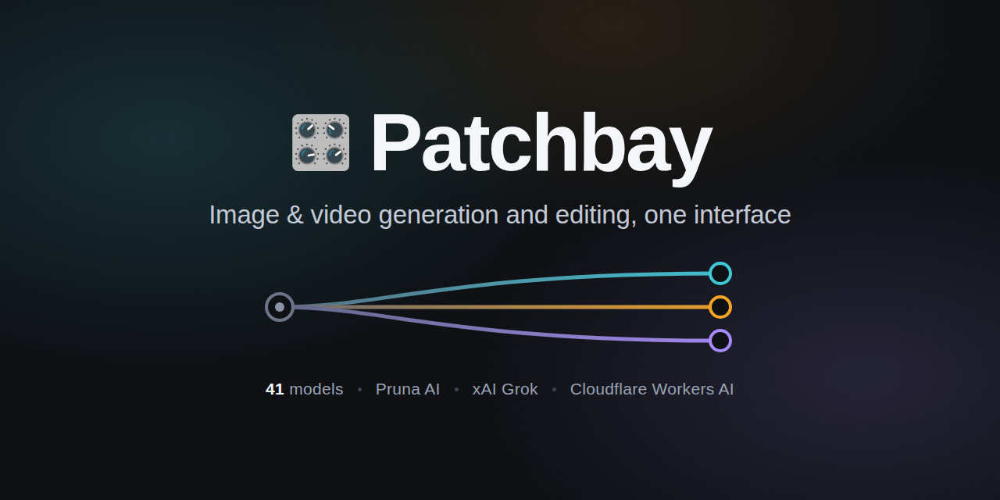

<p align="center">
  
</p>

Patchbay is a web front end for image and video generation and editing. It puts
48 models from three providers behind one interface and runs entirely on
Cloudflare Workers — no server to maintain, no build step, no framework.

| Provider | Models | Credentials |
|----------|--------|-------------|
| [Pruna AI](https://docs.api.pruna.ai/) | 32 | `PRUNA_API_KEY` |
| [Cloudflare Workers AI](https://developers.cloudflare.com/workers-ai/models/) | 11 | none |
| [xAI (Grok)](https://docs.x.ai/) | 5 | `XAI_API_KEY` |

A further 18 models run behind the three prompt tools rather than appearing in
the picker: 14 Workers AI chat models rewrite prompts, 3 Workers AI vision
models caption images, and Pruna's `p-judger` scores an image against a prompt.

## Features

**One picker, grouped by task.** Models are filed under Image editing, Image
generation, Video and LoRA training, each split by provider — provider decides
what a model costs and which key it needs, and two of them ship FLUX.2 Klein 4B
under the same name.

**Options panel.** Every optional parameter is visible and pre-filled. Modified
rows get an accent bar and their own Reset, and the header counts what has
changed. A parameter is sent only when it differs from the provider's default,
so what you see is what the provider would do anyway.

**Mode switching.** Grok's video model reaches three different endpoints —
generate, edit, extend. Picking a mode changes which fields apply, and fields
belonging to another mode are never sent.

**Prompt rewriting.** Improve runs the prompt through one of 14 Workers AI chat
models as a copy edit: grammar, phrasing and punctuation only. It adds nothing,
drops nothing, keeps your pronouns and your grammatical mood, and avoids commas,
which image models read as tag separators rather than punctuation. The result
reaches the prompt box exactly as the model produced it — the Worker does not
rewrite it afterwards.

**Image description.** Describe captions an image with one of 3 Workers AI
vision models and drops the caption in as a starting prompt. It reads whatever
image is already attached and only opens a file picker when there is none.

**Prompt-match scoring.** Judge runs Pruna's `p-judger` over an image and
returns how well it matches the prompt. It scores the image you just generated
if one is on screen, otherwise the one attached to the model's inputs, and the
note under the toolbar always says which — with an inline link to a file picker
for anything else, which also reaches batch mode (up to 10 images against a
shared prompt). The score lands under the toolbar rather than in the output
panel, so scoring a generation does not clear the generation.

**Uploads.** Init images, edit references, start and end frames, masks, and
source video or audio are proxied to the provider and referenced by URL.

**Cost visibility.** List prices per model, live estimates that follow your
settings, and Workers AI neuron consumption against the free daily allowance.

**Resilient requests.** Dropped connections are retried, except where a retry
could bill twice — a generation that may already have reached the provider is
reported rather than repeated.

**No persistence.** Nothing is stored server-side. Generated media is served
`no-store`, so neither the browser nor Cloudflare's edge keeps a copy.

**Job recovery.** A phone can discard the tab mid-generation to reclaim memory,
and the provider job keeps running and billing regardless. The running job's
id is kept in this browser — id and model only, never the input or the output —
so the next load reattaches, polls it to completion and shows the result rather
than paying for output nobody sees. The media still streams from the provider on
demand; the `input` object is deliberately excluded, since Workers AI and xAI
models carry base64 and `data:` URI images inline. A record is discarded once
collected, once the job definitively fails, or after an hour (six for training
runs, which legitimately take that long).

**Credential isolation.** API keys live in Cloudflare secrets and never reach
the browser. Every provider call is made by the Worker.

**Optional password gate.** With `APP_PASSWORD` set, every route except
`/api/config` requires the matching header.

## Architecture

```
Browser (public/)  ──►  Cloudflare Worker (src/worker.js)  ──┬──►  Pruna AI API
   static UI                                                 ├──►  xAI API
                                                             └──►  Workers AI (env.AI)

   /api/config          catalog + auth flag                 (public)
   /api/generate        dispatches on the model's provider
   /api/status          polls async jobs (Pruna, xAI video)
   /api/upload          proxies file uploads
   /api/result          streams media back, adds credentials, no-store
   /api/improve-prompt  copy-edits a prompt via Workers AI
   /api/describe        captions an image via Workers AI
   /api/judge           scores an image against a prompt via Pruna p-judger
   /api/neurons         current-day Workers AI neuron spend
```

`src/models.js` is the single source of truth. The Worker uses it to allow-list
models and to serve `/api/config`; the browser renders its entire UI from the
same data. Each model carries a `provider` tag and `handleGenerate` dispatches
on it, so adding a model is usually a catalog edit alone.

Image jobs are submitted with `Try-Sync: true` and fall back to polling. Video
and training jobs poll `/api/status` until they finish. Workers AI runs
synchronously and returns no job id.

## Models

### Pruna (32)

| Group | Models |
|-------|--------|
| Image editing | `p-image-edit`, `p-image-edit-lora`, `p-image-edit-text-aware`, `p-image-rmbg`, `p-image-try-on`, `p-try-on-glasses`, `p-image-upscale`, `qwen-image-edit-plus` |
| Image generation | `flux-dev`, `flux-dev-lora`, `flux-2-klein-4b`, `qwen-image`, `qwen-image-fast`, `z-image-turbo`, `z-image-turbo-lora`, `z-image-turbo-small`, `p-image`, `p-image-lora`, `p-image-ideogram`, `wan-image-small` |
| Video | `wan-t2v`, `wan-i2v`, `p-video`, `p-video-edit`, `p-video-2`, `p-video-infiniteworlds`, `p-video-animate`, `p-video-replace`, `p-video-avatar`, `vace` |
| LoRA training | `p-image-trainer`, `p-image-edit-trainer` |

`p-video-edit` rewrites an existing clip from a text prompt, with up to 4
optional reference images to guide identity or style. The source may be at most
15 seconds and the output runs the same length, so it is billed per second of
that length — $0.045, or $0.025 in draft mode — and the estimate comes from the
duration the browser reads off your clip when you pick it.

`p-video-2` takes the same inputs as `p-video` at roughly a 25% premium, and its
Length box is blank by default: leave it that way and the model picks the length
from the prompt. Nothing can be estimated in that case, and no estimate is shown
rather than a guessed one. Where audio is attached to `p-video`, `p-video-2` or
`p-video-infiniteworlds`, the track sets the length and therefore the bill, so
the browser reads its duration and prices from that instead of the Length box.

`p-image-rmbg` returns a transparent PNG and takes exactly one input, the image
— no options at all. `p-image-edit-text-aware` routes to whichever edit model
suits the input, which changes the price: $0.01 per output, or $0.03 when it
detects text in the image. That decision happens during the run, so the app
shows the range up front and no per-run estimate. Its `turbo` is left at Pruna's
documented default of on, unlike `p-image-edit`, where this repo deliberately
forces it off.

**`p-image-pro` is documented but not included.** As of 2026-09-08 every call to
it — including a bare prompt — is refused before input validation with
`422 Deployment disabled`. Listing a model that cannot run is worse than leaving
it out; `src/models.js` carries a comment with its full parameter set and price
so it can be restored when Pruna enables the deployment.

`p-judger` is a Pruna model too, but it scores rather than generates, so it sits
behind the Judge button instead of in the picker. Its documentation describes a
score object carrying `total`, `level1`, `level2`, `level3` and `detailed`; as
of 2026-09-08 the endpoint returns `total` alone and rejects any undocumented
input key, so the UI headlines `total` and keeps the whole payload one tap away
rather than assuming the shape. The scale is not documented, so the score is
rendered as a bare number — no bar, no percentage.

LoRA variants (`*-lora`) take a weights URL and a strength scale, and several
ship quick-pick presets. `p-image-lora` and `p-image-edit-lora` require weights
from Pruna's own trainers; other sources are rejected by those two endpoints.
The remaining variants accept HuggingFace URLs, and `z-image-turbo-lora` accepts
any host.

The two trainers emit a `.zip` of weights rather than an image, and are billed
per 1,000 training steps. A run takes minutes to hours and its output link
expires about 30 minutes after it finishes.

### Cloudflare Workers AI (11)

`cf-flux-1-schnell`, `cf-flux-2-klein-4b`, `cf-flux-2-klein-9b`, `cf-flux-2-dev`,
`cf-lucid-origin`, `cf-phoenix-1`, `cf-sdxl-base`, `cf-sdxl-lightning`,
`cf-dreamshaper-8`, `cf-sd15-img2img`, `cf-sd15-inpainting`

These run on Cloudflare's GPUs through the `AI` binding and need no key of their
own. The free allowance is 10,000 neurons per day; `/api/neurons` reports
consumption against it.

### xAI / Grok (5)

`xai-imagine-image`, `xai-imagine-image-quality`, `xai-imagine-image-2`,
`xai-imagine-video`, `xai-imagine-video-1-5`

The image models generate, or edit up to 3 reference images. Both video models
are asynchronous and poll to completion, and each covers three endpoints through
its Mode field:

- **Generate** — text-to-video, or image-to-video with a starting image, or
  reference-to-video with up to 3 reference images. On 1.5 a preset voice can be
  added, tagged in the prompt as `<AUDIO_0>`.
- **Edit** — changes an existing video. Length, resolution and aspect ratio are
  inherited from the source, so those fields do not apply.
- **Extend** — continues an existing video. Its duration is the length of the
  added footage, not the total.

`grok-imagine-video-1.5` is not a straight upgrade: it publishes a 1080p rate
that 1.0 does not and accepts preset voices, but costs more per second.

## Deployment

Requires Node 18+ and a Cloudflare account.

```bash
npm install

# Required
npx wrangler secret put PRUNA_API_KEY      # Pruna API key

# Optional
npx wrangler secret put XAI_API_KEY        # enables the xAI / Grok models
npx wrangler secret put APP_PASSWORD       # enables the password gate
npx wrangler secret put CF_ACCOUNT_ID      # enables /api/neurons reporting
npx wrangler secret put CF_ANALYTICS_TOKEN # requires Account Analytics: Read

npm run deploy
```

Missing optional credentials degrade gracefully: the affected models stay in the
picker and return an explicit "not configured" error rather than failing
somewhere less obvious.

Secrets take effect immediately and need no redeploy:

```bash
printf '%s' 'pru_...' | npx wrangler secret put PRUNA_API_KEY
```

They can also be set from the Cloudflare dashboard, under Workers & Pages →
Settings → Variables and Secrets.

## Local development

Put the same values in a git-ignored `.dev.vars` and run `npm run dev`:

```
# .dev.vars
PRUNA_API_KEY=pru_...
XAI_API_KEY=xai-...
APP_PASSWORD=...
```

The `AI` binding is declared `remote: true` in `wrangler.jsonc` because Workers
AI has no local emulation — without it every AI call fails with `Binding AI
needs to be run remotely`. Inference during local development is billed
normally.

## Installing as a PWA

A web manifest and touch icons are included, so the app installs to a home
screen and launches without browser chrome. Installed instances get their own
storage context, so the password gate and saved prompts are scoped separately
from the browser.

## Operational notes

- The app is served `noindex, nofollow`.
- The Worker proxies paid API credentials, so the password gate is advisable on
  any deployment whose URL might be discovered.
- Cloudflare secrets are write-only. Their names can be listed but their values
  cannot be read back, so a forgotten password has to be replaced rather than
  recovered.
- Changing the Worker name in `wrangler.jsonc` provisions a *new* Worker at a
  new URL rather than renaming the existing one. Secrets do not transfer, and
  the previous Worker keeps serving until it is deleted.

## License

[MIT](LICENSE)
